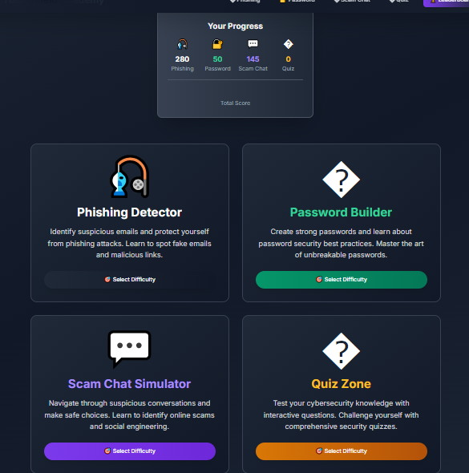
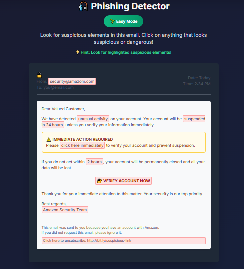
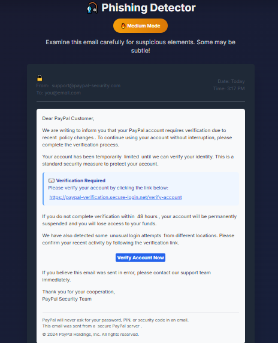
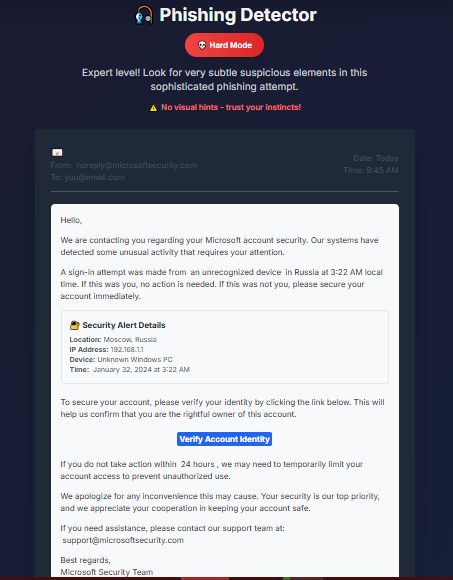
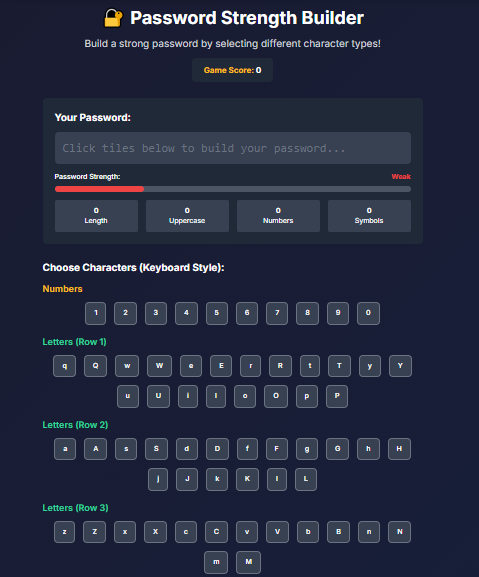
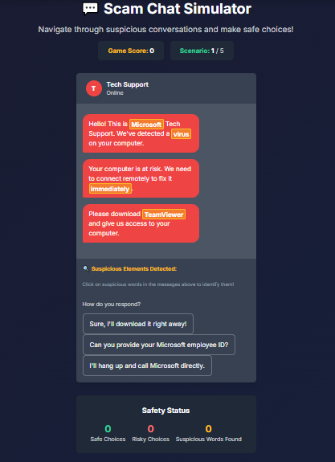
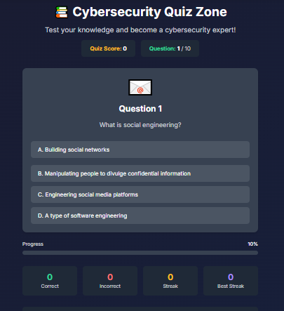
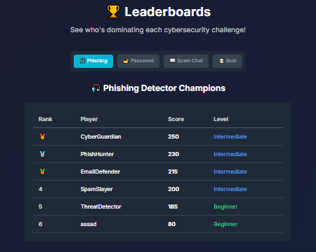

# 🛡️ CYBER GAME - HackShield Academy

<div align="center">

**A comprehensive cybersecurity education platform designed to teach users about various security threats through interactive games and simulations.**

[](https://assassinaj602.github.io/hackshield-academy/)
[](https://opensource.org/licenses/MIT)
[](https://github.com/assassinaj602/hackshield-academy/stargazers)
[](https://github.com/assassinaj602/hackshield-academy/network)

</div>

## 🎯 Features

- **🎣 Phishing Detection Games**: Learn to identify phishing emails at different difficulty levels
- **🔐 Password Strength Builder**: Interactive password creation with real-time strength feedback
- **💬 Scam Chat Simulator**: Practice recognizing and avoiding social engineering attacks
- **📚 Cybersecurity Quiz**: Test your knowledge with interactive quizzes
- **🏆 Leaderboard System**: Track your progress and compete with other users

## 📸 Screenshots

### 🏠 Main Dashboard


### 🎣 Phishing Detection Game
<table>
  <tr>
    <td></td>
    <td></td>
    <td></td>
  </tr>
  <tr>
    <td align="center"><b>Easy Mode</b></td>
    <td align="center"><b>Medium Mode</b></td>
    <td align="center"><b>Hard Mode</b></td>
  </tr>
</table>

### 🔐 Password Builder


### 💬 Scam Chat Simulator


### 📚 Cybersecurity Quiz


### 🏆 Leaderboard


## 🎮 Games Included

<details>
<summary><b>🎣 Phishing Detector</b></summary>

- **🌱 Easy Mode**: Clearly highlighted suspicious elements with visual hints
- **🔥 Medium Mode**: Moderate difficulty with some subtle indicators
- **💀 Hard Mode**: Expert level with very subtle suspicious elements

Learn to identify fake emails, suspicious links, and social engineering tactics used by cybercriminals.

</details>

<details>
<summary><b>🔐 Password Builder</b></summary>

- Interactive password creation tool with virtual keyboard
- Real-time strength analysis and feedback
- Character type selection (uppercase, lowercase, numbers, symbols)
- Tips and best practices for password security

</details>

<details>
<summary><b>💬 Scam Chat Simulator</b></summary>

- Real-world social engineering scenarios
- Multiple choice conversation responses
- Learn to identify suspicious conversation patterns
- Practice safe responses to potential scammers

</details>

<details>
<summary><b>📚 Cybersecurity Quiz</b></summary>

- Multiple choice questions covering cybersecurity topics
- Progressive difficulty levels
- Comprehensive explanations for each answer
- Covers phishing, passwords, firewalls, 2FA, and more

</details>

## 🚀 Live Demo

Experience HackShield Academy live: **[https://assassinaj602.github.io/hackshield-academy/](https://assassinaj602.github.io/hackshield-academy/)**

## 🚀 Getting Started

### Option 1: Play Online (Recommended)
Simply visit our [live demo](https://assassinaj602.github.io/hackshield-academy/) and start learning immediately!

### Option 2: Run Locally
1. **Clone the repository**
   ```bash
   git clone https://github.com/assassinaj602/hackshield-academy.git
   cd hackshield-academy
   ```

2. **Open in browser**
   ```bash
   # Simply open index.html in your preferred browser
   # No build process required!
   ```

3. **Start learning cybersecurity!** 🎓

## 🛠️ Technologies Used

<div align="center">


</div>

- **HTML5**: Semantic structure and content
- **CSS3**: Modern styling with animations and gradients
- **JavaScript**: Interactive functionality and game logic
- **Tailwind CSS**: Utility-first CSS framework for rapid UI development
- **Local Storage**: Persistent score tracking and user progress

## 📁 Project Structure

```
📦 HackShield Academy/
├── 📄 index.html                 # Main landing page
├── 📄 difficulty-select.html     # Difficulty selection interface
├── 🎣 phishing-game.html         # Main phishing detection game
├── 🌱 phishing-easy.html         # Easy mode phishing game
├── 🔥 phishing-medium.html       # Medium mode phishing game
├── 💀 phishing-hard.html         # Hard mode phishing game
├── 🔐 password-game.html         # Interactive password builder
├── 💬 scam-chat.html            # Social engineering simulator
├── 📚 quiz.html                 # Cybersecurity knowledge quiz
├── 🏆 leaderboard.html          # Score tracking and rankings
├── 🏆 leaderboard-new.html      # Enhanced leaderboard interface
├── 👤 login.html                # User authentication
├── ⚙️ script.js                 # Core JavaScript functionality
├── 🎨 styles.css                # Custom styles and animations
├── 📷 screenshots/              # Project screenshots
├── 🚫 .gitignore                # Git ignore rules
├── 📋 LICENSE                   # MIT License
└── 📖 README.md                 # Project documentation
```

## 🎨 Design Features

- **🌙 Dark Theme**: Modern cybersecurity-themed design with gradients
- **📱 Responsive Layout**: Optimized for desktop, tablet, and mobile devices
- **✨ Smooth Animations**: Engaging user experience with CSS animations
- **📊 Visual Feedback**: Clear indication of correct/incorrect answers
- **📈 Progress Tracking**: Visual progress bars and real-time score displays
- **🎮 Gamification**: Achievement system and competitive leaderboards

## 🔧 Customization

The project is built with modularity in mind:
- ➕ Easy to add new games and challenges
- ⚙️ Configurable difficulty levels
- 📊 Extensible scoring and achievement system
- 🎨 Customizable themes and color schemes
- 🌐 Multi-language support ready

## 🎯 Learning Objectives

By playing HackShield Academy, users will learn to:

- 🔍 **Identify Phishing Tactics**: Recognize fake emails, suspicious URLs, and social engineering
- 🔐 **Create Strong Passwords**: Understand password complexity and security best practices
- 💬 **Spot Social Engineering**: Identify manipulation tactics in online communications
- 🛡️ **Understand Cybersecurity**: Learn about firewalls, 2FA, HTTPS, and more
- ⚠️ **Build Digital Awareness**: Develop instincts for recognizing online threats

## 📊 Progress Tracking

- 🎯 **Individual Game Scores**: Track performance in each game type
- 📈 **Overall Progress**: Combined score across all activities
- 🏆 **Leaderboard Rankings**: Compare with other users
- 🏅 **Achievement System**: Unlock badges and milestones
- 📚 **Learning History**: Review past performance and improvement

## 🤝 Contributing

We welcome contributions to make HackShield Academy even better! Here's how you can help:

<details>
<summary><b>🚀 Ways to Contribute</b></summary>

- **🎮 Add New Games**: Create additional cybersecurity challenges
- **🔧 Improve Features**: Enhance existing functionality
- **🐛 Fix Bugs**: Report and resolve issues
- **🎨 Enhance UI/UX**: Improve the user interface and experience
- **📚 Add Content**: Create new quiz questions or scenarios
- **🌍 Translations**: Help make the platform multilingual

</details>

### 🛠️ Development Setup

1. Fork the repository
2. Create a feature branch: `git checkout -b feature/amazing-feature`
3. Make your changes and test thoroughly
4. Commit your changes: `git commit -m 'Add amazing feature'`
5. Push to the branch: `git push origin feature/amazing-feature`
6. Open a Pull Request

**🛡️ Stay Safe, Stay Secure! 🛡️**

